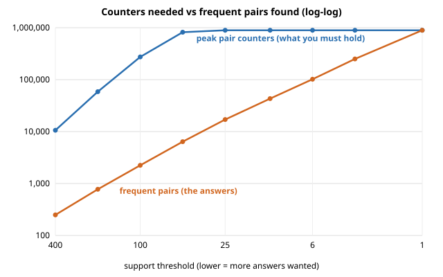

# Task 2 · Lower the threshold until the machine says no

## A6 · Machine

MacBook Pro, Apple M4 Pro, 24 GB RAM, macOS 26.6.2, Python 3.13.7. Other apps open: Claude desktop app, Adobe Creative Cloud, Telegram. Timings and MB are about this machine; counters and pair counts are not.

## A1, A3 · Peak counters against support (from `out/explosion.json`)

Data: 20,000 baskets, 2,000 items, 893,456 different pairs actually appear together. Method: `PlainApriori` (A-Priori, no PCY). Supports run from 400 down to 1, a 400x range.

| support | frequent pairs | peak counters | counters per answer | time (s) | peak memory (MB) |
|---:|---:|---:|---:|---:|---:|
| 400 | 249 | 10,585 | 42 | 0.37 | 1.1 |
| 200 | 776 | 58,626 | 76 | 0.57 | 6.4 |
| 100 | 2,244 | 273,701 | 122 | 1.29 | 26.4 |
| 50 | 6,397 | 820,259 | 128 | 1.95 | 102.2 |
| 25 | 17,045 | 893,456 | 52 | 2.38 | 102.2 |
| 12 | 43,116 | 893,456 | 21 | 2.39 | 102.7 |
| 6 | 101,938 | 893,456 | 8.8 | 2.49 | 119.4 |
| 3 | 250,054 | 893,456 | 3.6 | 2.55 | 156.7 |
| 1 | 893,456 | 893,456 | 1.0 | 3.66 | 327.1 |

## A2 · Where it broke

It did not break on this machine. At support 1 the run takes 3.7 s and 327 MB on 24 GB of RAM, so nothing ran out, neither time nor memory. I stopped at support 1 because it cannot go lower: at support 1 every pair that appears at all is frequent.

The reason is the size of the data. The counters stop growing at 893,456, which is the number of different pairs that appear in these baskets (out of 1,999,000 possible pairs). Once every pair has a counter, a lower support cannot add more.

Extrapolation, not measured: one counter costs about 125 bytes (102.2 MB for 820,259 counters). A shop with 10,000 items has up to 50 million possible pairs, which would be about 6 GB of counters, and that is where a laptop starts to break.

## A4 · Growth of the counters

Each halving of the support multiplies the counters by 5.5 (400 to 200), then 4.7 (200 to 100), then 3.0 (100 to 50). That is worse than doubling. Then it stops: 1.09x from 50 to 25 and exactly 1.00x after that, because every pair already has its counter.

## A5 · Frequent pairs against counters

The answers grow slowly and steadily: about 2.4 to 3.1 times more pairs for each halving (249 at support 400, 6,397 at 50, 893,456 at 1). The counters grow much faster at first (see A4) and only then stop. So the gap between "what I must hold" and "what I get" is biggest around support 50 to 100: 128 counters for every pair found at support 50 (820,259 counters for 6,397 answers). That gap is the whole problem: we pay for hundreds of counters, and almost all of them end up below the threshold and are thrown away. This is what PCY (Task 3) goes after.
